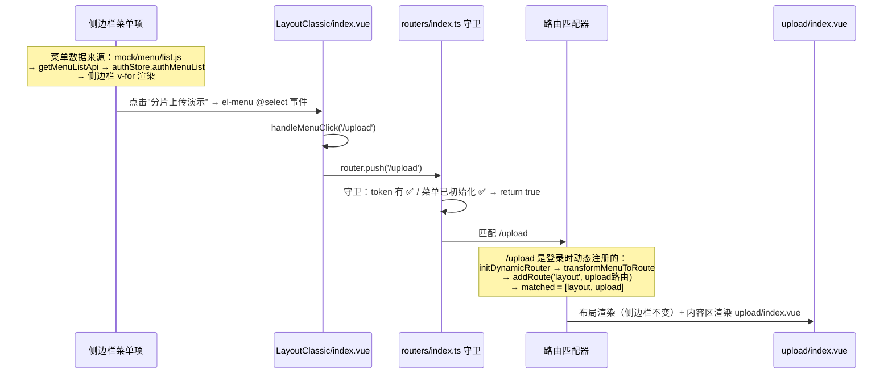
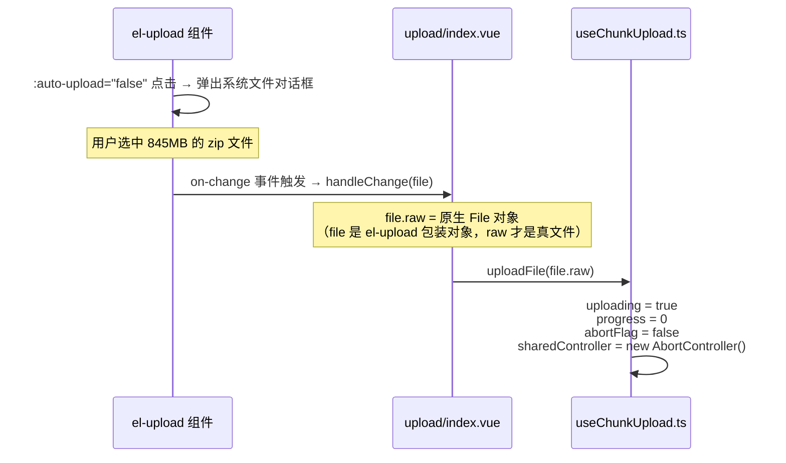
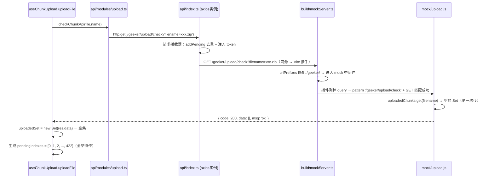
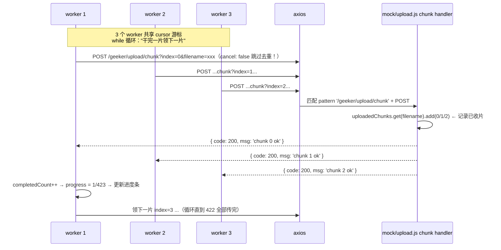
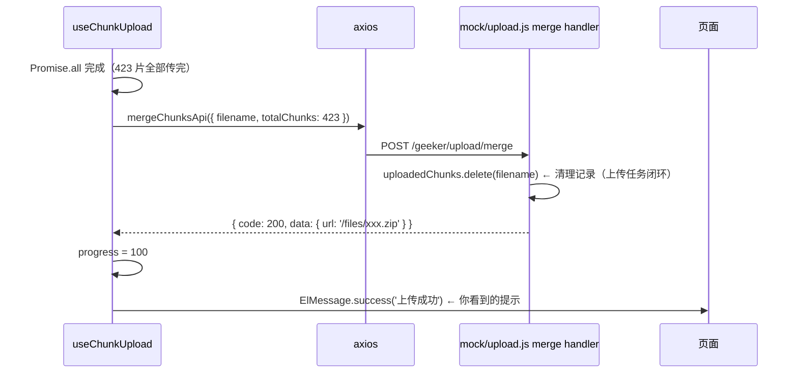
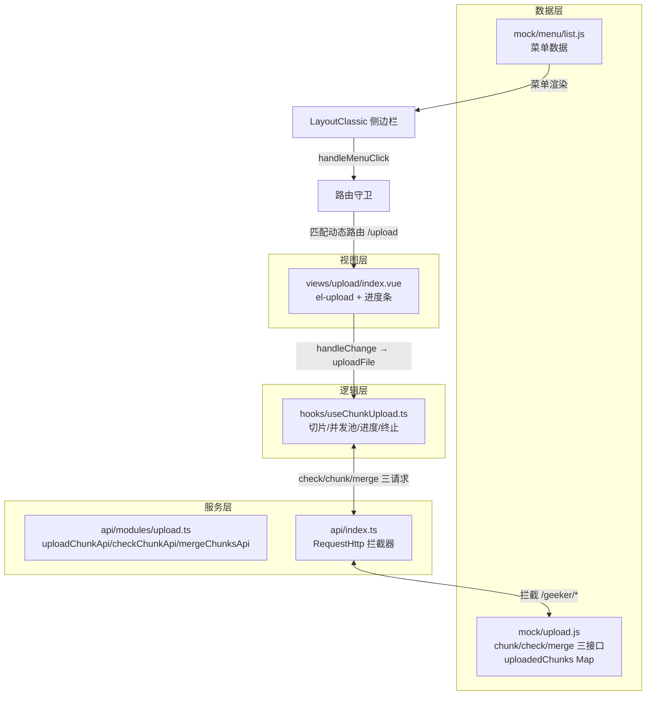

# 分片上传全链路梳理

> 从前端点击"分片上传演示"菜单 → 选择文件 → 分片上传 → Mock 配合 → 上传成功提示的完整链路
> 覆盖五个阶段、九个文件、关键函数与变量
> 配套知识点：断点续传、主动终止、Promise 并发池

---

## 阶段一：点击菜单 → 页面呈现（路由链路）

### 经过的文件与关键点

| 文件                      | 函数/变量               | 作用                                                  |
| ------------------------- | ----------------------- | ----------------------------------------------------- |
| `mock/menu/list.js`       | 菜单 JSON               | "分片上传演示"菜单项的数据源头                        |
| `LayoutClassic/index.vue` | `handleMenuClick(path)` | 菜单点击 → 路由跳转                                   |
| `routers/index.ts`        | `beforeEach` 守卫       | 安检：登录态 + 菜单初始化检查                         |
| `dynamicRouter.ts`        | `transformMenuToRoute`  | 登录时把 `component: 'upload/index'` 字符串翻译成组件 |

---

## 阶段二：点击"选择文件" → 上传启动

### 关键变量（useChunkUpload.ts 内部）

| 变量                             | 类型                | 作用                               |
| -------------------------------- | ------------------- | ---------------------------------- |
| `chunks`                         | `Blob[]`            | 423 个分片（845MB ÷ 2MB）          |
| `totalChunks`                    | number              | 423                                |
| `pendingIndexes`                 | `number[]`          | 待传片序号（断点续传时跳过已传的） |
| `completedCount`                 | number              | 已完成片数（进度计算基准）         |
| `cursor`                         | number              | 并发池共享游标                     |
| `abortFlag` / `sharedController` | 终止标志 / 取消信号 | 主动终止用                         |

---

## 阶段三：check 接口 —— 问服务端"你有哪些片了"

### 关键点

- `mock/upload.js` 顶部的 **`uploadedChunks` Map** 是"服务端磁盘"的模拟——`filename → Set<片序号>`
- 响应经 axios **响应拦截器**统一处理（错误提示、code 校验）后才回到业务代码
- `res.data` 解包是接口约定（`{ code, data, msg }` 结构）——忘记解包会报 `object is not iterable`

---

## 阶段四：并发上传 —— Promise 池 + mock 记录

### 这一步的三个关键设计

1. **`{ cancel: false }`**（uploadChunkApi 第三参数）——**没有它整个上传直接崩**：423 个请求的 method+url 相同、FormData 序列化后都是 `{}`，去重 key 全相同，AxiosCanceler 会把每个新片当成"重复请求"取消掉前一片（CanceledError 坑）
2. **游标共享**：`pendingIndexes[cursor++]` 是原子操作（JS 单线程），3 个 worker 不会领到同一片
3. **进度公式**：`progress = completedCount / totalChunks × 100`——每片等大，按片数算即可

---

## 阶段五：merge + 成功提示

---

## 全链路一张总图

---

## 十个关键文件速查

| #   | 文件                      | 职责         | 关键函数/变量                                                   |
| --- | ------------------------- | ------------ | --------------------------------------------------------------- |
| 1   | `mock/menu/list.js`       | 菜单数据源   | 菜单 JSON                                                       |
| 2   | `LayoutClassic/index.vue` | 菜单点击跳转 | `handleMenuClick`                                               |
| 3   | `routers/index.ts`        | 导航安检     | `beforeEach` 守卫                                               |
| 4   | `dynamicRouter.ts`        | 动态路由注册 | `initDynamicRouter`、`transformMenuToRoute`                     |
| 5   | `views/upload/index.vue`  | 上传页       | `handleChange`、`progress`                                      |
| 6   | `hooks/useChunkUpload.ts` | **核心逻辑** | `uploadFile`、`uploadOne`、`chunks`、`cursor`、`completedCount` |
| 7   | `api/modules/upload.ts`   | 接口声明     | `uploadChunkApi`、`checkChunkApi`、`mergeChunksApi`             |
| 8   | `api/index.ts`            | 拦截器层     | 请求/响应拦截器、`cancel: false` 逃生舱                         |
| 9   | `build/mockServer.ts`     | Mock 入口    | `urlPrefixes`、JSON body 中间件                                 |
| 10  | `mock/upload.js`          | 假后端       | `uploadedChunks` Map、三个 handler                              |

---

## 断点续传与主动终止要点速记

### 断点续传三要素

1. **切片**：文件切成可定位的单元（`file.slice`）
2. **check 接口**：查询服务端已收到的片序号
3. **跳过已传**：游标遍历"待传列表"（`pendingIndexes`），进度从已有片数起步

### 主动终止两件事

1. `abortFlag = true` —— 阻止新片开始（循环条件）
2. `sharedController.abort()` —— 中断正在飞的请求（axios `signal`）

### 本次实战踩过的坑

| 坑                           | 根因                                       | 解法                                  |
| ---------------------------- | ------------------------------------------ | ------------------------------------- |
| `CanceledError`              | 去重 key 相同（FormData 序列化都是 {}）    | `{ cancel: false }` 逃生舱            |
| check 接口 404               | mock 文件模板字符串未闭合（反引号+单引号） | 修复语法 + 重启 dev                   |
| `checkApi is not defined`    | hook 里没解构                              | 解构补上                              |
| `checkApi is not a function` | 演示页没传配置                             | `checkApi: checkChunkApi`             |
| `object is not iterable`     | 忘了解包 `res.data`                        | `new Set(res.data)`                   |
| 刷新动态路由页 404           | 兜底重定向发生在守卫前                     | 守卫用 `to.redirectedFrom` 找回原目标 |

---

_文档生成时间：2026-09-27 ｜ 项目路径：F:\frontend-program\vue\my-admin_
