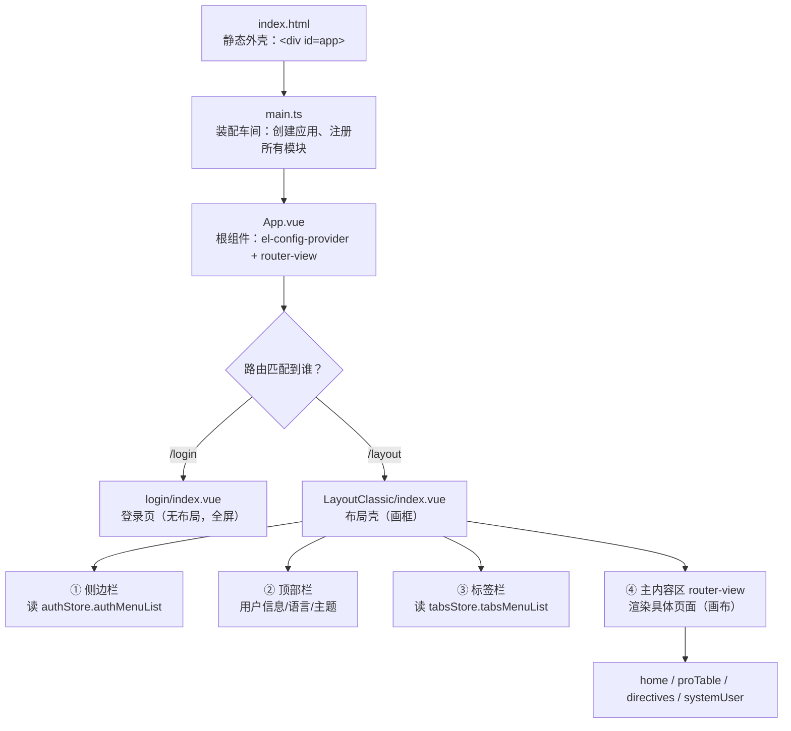
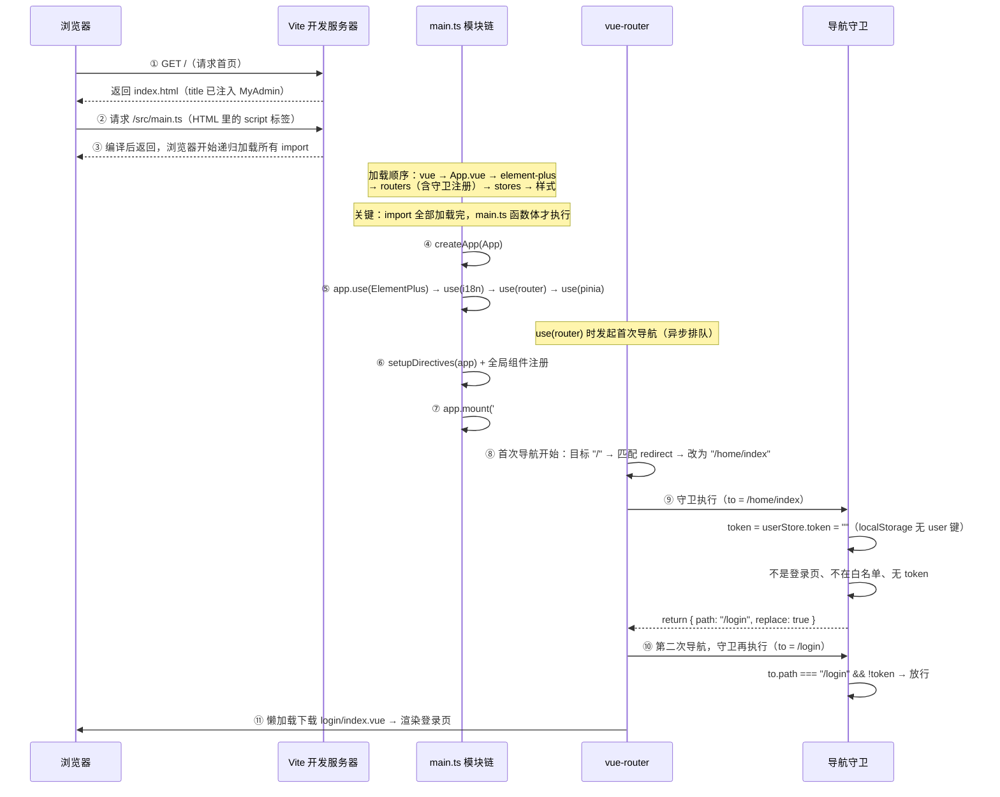
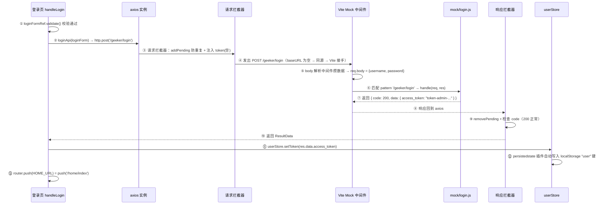
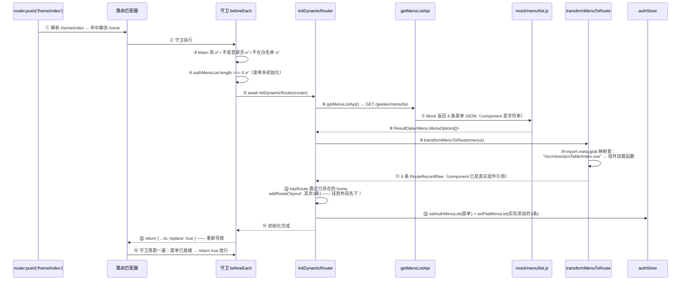
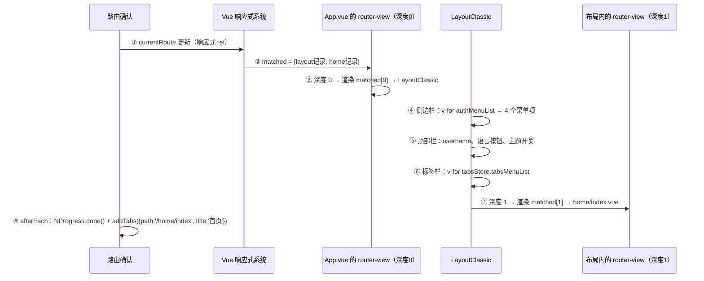
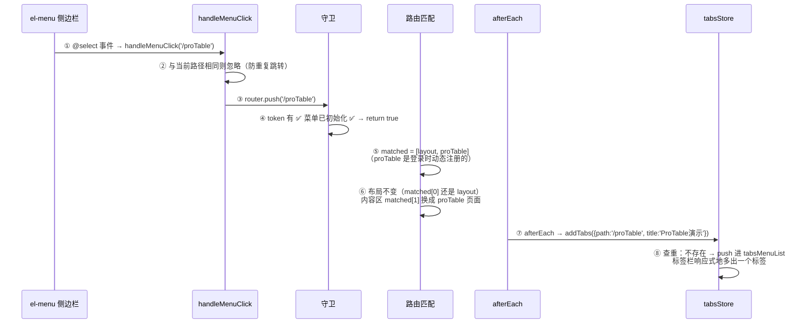
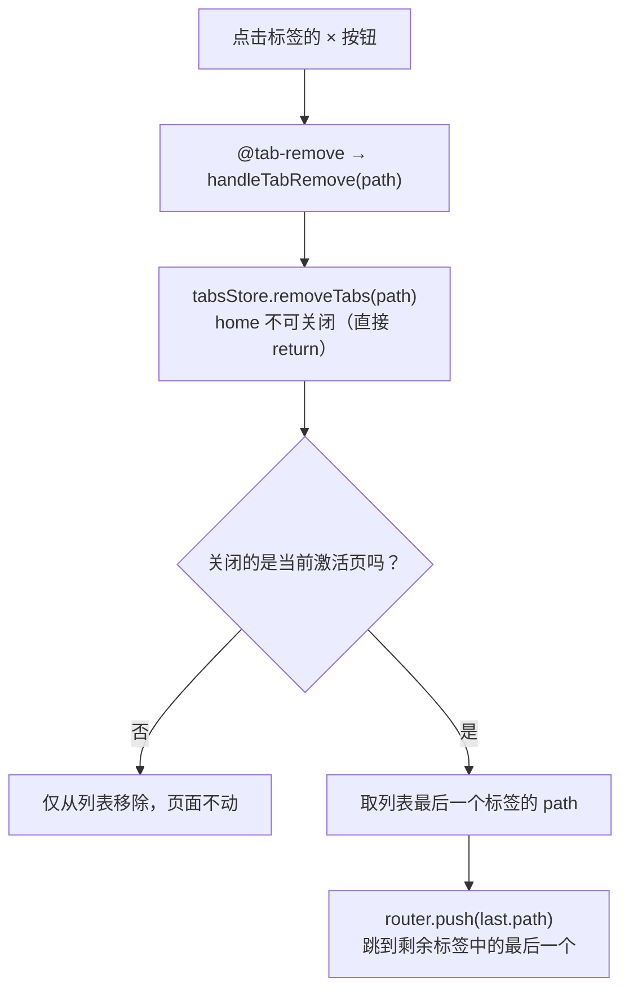
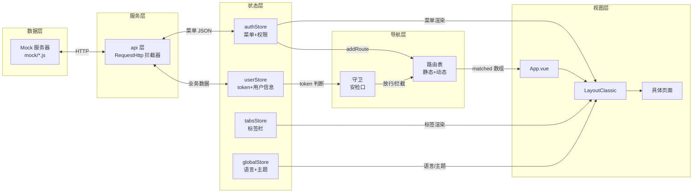

全局架构完整梳理

一、先建立"嵌套"的直观模型

你说"一环嵌套一环"的感觉是对的。整个应用的物理结构是这样的：

核心认知：布局是"画框"，router-view 是"画布"。画框只渲染一次，切路由只换画布里的画。
所有你感觉"嵌套"的地方，本质都是两层结构：

┌────────────────┬──────────────────────┬────────────────────────────┐
│ 嵌套 │ 外层（不变） │ 内层（可变） │
├────────────────┼──────────────────────┼────────────────────────────┤
│ App.vue → 页面 │ el-config-provider │ router-view 渲染的路由组件 │
├────────────────┼──────────────────────┼────────────────────────────┤
│ Layout → 页面 │ 侧边栏/顶部栏/标签栏 │ 主内容区 router-view │
├────────────────┼──────────────────────┼────────────────────────────┤
│ 路由匹配 │ layout 记录（父） │ 具体页面记录（子） │
└────────────────┴──────────────────────┴────────────────────────────┘

---

二、流程 1：localhost:8848 → 登录页呈现

每个环节的文件与设计意图：

┌──────┬────────────────────────┬───────────────────────┬─────────────────────────────────────────────────────┐
│ 步骤 │ 文件 │ 关键函数/变量 │ 设计意图 │
├──────┼────────────────────────┼───────────────────────┼─────────────────────────────────────────────────────┤
│ ① │ index.html │ 
 │ Vue 的挂载点，全应用唯一真实 DOM │
├──────┼────────────────────────┼───────────────────────┼─────────────────────────────────────────────────────┤
│ ③ │ main.ts │ 全部 import │ ESM 静态导入先加载后执行，模块图在此刻定型 │
├──────┼────────────────────────┼───────────────────────┼─────────────────────────────────────────────────────┤
│ ⑤ │ main.ts │ app.use(router) │ 安装即发起首次导航——早于 pinia │
│ │ │ │ 安装，但守卫在微任务里执行，此时 pinia 已就绪 │
├──────┼────────────────────────┼───────────────────────┼─────────────────────────────────────────────────────┤
│ ⑧ │ staticRouter.ts │ { path: "/", │ 根路径永远指向首页 │
│ │ │ redirect: HOME_URL } │ │
├──────┼────────────────────────┼───────────────────────┼─────────────────────────────────────────────────────┤
│ ⑨ │ routers/index.ts │ beforeEach 守卫 │ 全应用唯一的安检口，任何导航都过这里 │
├──────┼────────────────────────┼───────────────────────┼─────────────────────────────────────────────────────┤
│ ⑨ │ stores/modules/user.ts │ userStore.token │ 持久化插件从 localStorage 的 "user" │
│ │ │ │ 键水合——刷新后登录态恢复的机制 │
└──────┴────────────────────────┴───────────────────────┴─────────────────────────────────────────────────────┘

---

三、流程 2：点击登录 → 首页完整呈现

这是全项目最复杂的一条链路，分三段走：

第一段：调接口拿 token

设计意图：

- axios 拦截器（api/index.ts）：token 注入、错误提示、登录过期跳转这些横切逻辑只写一次，业务代码只关心成功结果
- Mock 中间件（build/mockServer.ts）：让前端在没有后端时完整跑通——前后端并行开发的基石
- persistedstate（stores/index.ts 注册）：setToken 一行代码，插件自动同步
  localStorage——业务代码不知道持久化的存在，这就是"关注点分离"

第二段：守卫初始化动态路由

这一步是权限体系的心脏。import.meta.glob（dynamicRouter.ts 第 7 行）值得单独理解：

// 构建时，Vite 扫描 src/views 下所有 .vue，生成映射表：
const modules = {
"/src/views/home/index.vue": () => import("/src/views/home/index.vue"),
"/src/views/proTable/index.vue": () => import("/src/views/proTable/index.vue"),
// ...每个文件一个条目
};

// 后端菜单 JSON 里的字符串 "proTable/index"
// 在这里被"翻译"成真实的组件加载函数：
component: modules[`/src/views/${menu.component}.vue`]

后端只能给你字符串，前端把字符串翻译成组件——这就是前后端在动态路由上的分工契约。

第三段：渲染布局 + 首页

matched 数组是理解一切嵌套的钥匙：一次导航匹配出 [layout, home] 两条记录，两个 router-view
按"深度"各认领一条（provide/inject 传递 depth，阶段 8 问答里详解过）。

---

四、流程 3：点击侧边栏 → 页面切换 + 标签栏同步

3.1 点击菜单 → 内容区换页

关键认知：切页时 LayoutClassic 组件实例没有销毁（matched[0]
没变），销毁重建的只有内容区。侧边栏、顶部栏的状态（折叠状态等）天然保留——这就是布局嵌套路由的性能红利。

3.2 点击标签 → 切换页面

el-tabs 的 v-model = activeMenu（computed: route.path）
→ 点击标签 → @tab-change → handleTabChange(path)
→ router.push(path) → 守卫 → 内容区渲染对应页面
→ activeMenu 自动跟随 route.path（v-model 是路由的"影子"）

3.3 关闭标签 → 清理 + 跳转

设计意图：关闭当前页时必须立刻跳走（否则内容区还显示已关闭的页面，与标签栏不一致）——"标签栏是内容区的目录，两者必
须同步"。

3.4 退出登录的完整清理链（呼应之前的 404 坑）

logout() {
userStore.loginOut() // ① 清 token → 持久化同步清 localStorage
resetRouter() // ② 卸载 3 条动态路由（只删 flatMenuList 里的）
tabsStore.$reset() // ③ 标签栏回到初始态（只剩首页）
keepAliveStore.setKeepAliveName([]) // ④ 清空页面缓存名单
router.replace(LOGIN_URL) // ⑤ 回登录页
}

五个清理动作缺一不可——你之前遇到的 404 和标签残留，分别是 ② 和 ③
没做对导致的。真实项目的登出永远是"多资源清理"，这也是为什么复杂项目会把这套逻辑抽成独立的 resetAllStores 函数。

---

五、一张总图收尾

一句话总结整个架构：API 层拿数据 → Pinia 存状态 → 路由决定"显示哪一页" → 守卫在路由前把关 → 布局提供画框 →
页面填充画布。 你感觉的"一环嵌套一环"，就是这五个层次各司其职、层层接力。

---

梳理完这些，你对项目架构应该有了完整图景。随时可以进入阶段 12（构建优化与部署）——那是这个项目的最后一站。
